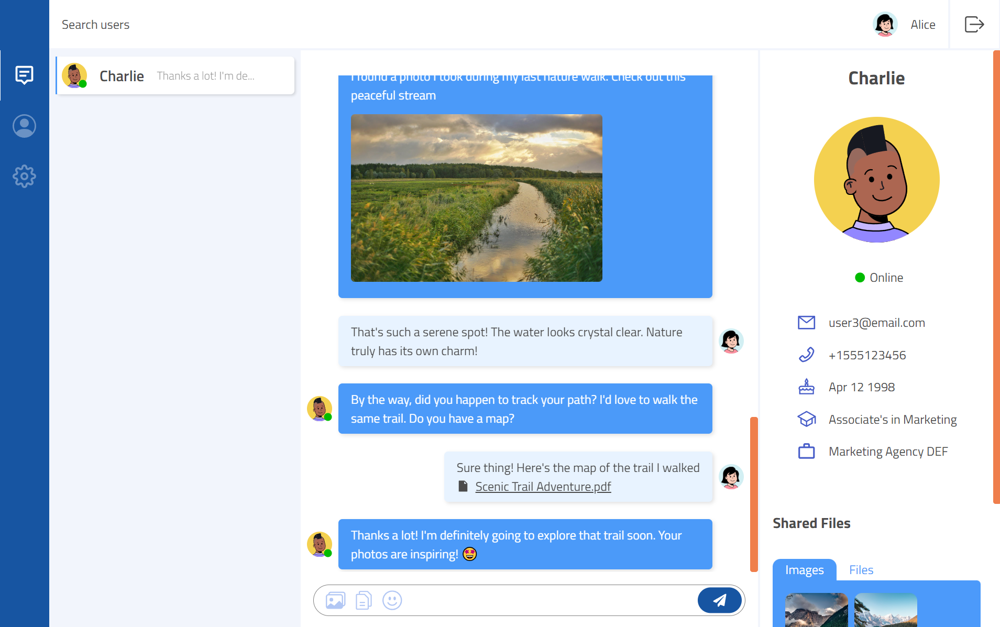

# Vista Chat

Vista Chat is a real-time messaging platform designed to facilitate seamless communication among users within a shared environment. This chat application leverages React on the frontend and Express, powered by Socket&#46;io, on the backend to offer an interactive conversation experience.

## Technologies Used

- **Frontend**: React.js
- **Backend**: Node.js/Express.js
- **Real-time Communication**: Socket&#46;io
- **Database**: MongoDB, Firebase Storage

---

## Key Features

### Account Management and Authentication

Vista Chat provides functionalities for account management, enabling users to create, update, and delete accounts, choose between light and dark theme, and create avatars. User authentication is handled through Json Web Tokens (JWTs) stored in cookies for enhanced security.

### Real-time Messaging

Enjoy real-time message delivery through web sockets using the Socket&#46;io library. Along with pushing new messages to the UI, the app also supports additional features that update the UI in real-time:

- new message notifications,
  
- online status updates,
  
- and typing indicators during chats.
  

### File Sharing

Share images and files seamlessly within conversations, securely stored in Firebase's Storage for a richer chat experience.

---

## Try It Out

[Test the app here](https://vista-chat-af.netlify.app/login) with provided demo users for a real-time chat experience. Open two different browsers, log in with one test user each, and interact between users. Explore the app's features by sending messages and observing live updates.

Feel free to send messages to test the features mentioned above. Users can delete their own messages by hovering and clicking the close button.

NOTE - if the app doesn't log you in immediately, it may take up to 30 seconds for the server to start up.
